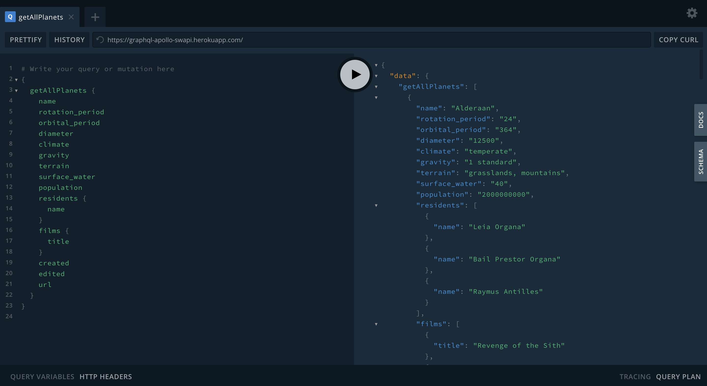

# GraphQL & Apollo Swapi

GraphQL & Apollo with SWAPI full server and client.

## Demo

Online demo is available on [https://graphql-apollo-swapi.herokuapp.com/](https://graphql-apollo-swapi.herokuapp.com/).

## Server

Available npm scripts:

* `npm run start:server` - Run GraphQL playground server
* `npm run start:server:watch` - Run GraphQL playground server width Nodemon

## Client

Available npm scripts:

* `npm run start:client` - Run GraphQL client
* `npm run start:client:watch` - Run GraphQL client width Nodemon

## Licence 🤞

`git-box` is licensed under the [MIT License](http://opensource.org/licenses/MIT).

Created with ♥ by [@yoriiis](http://github.com/yoriiis).
